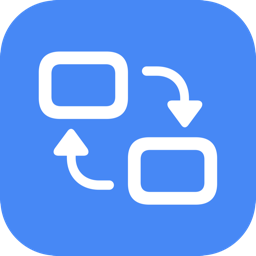
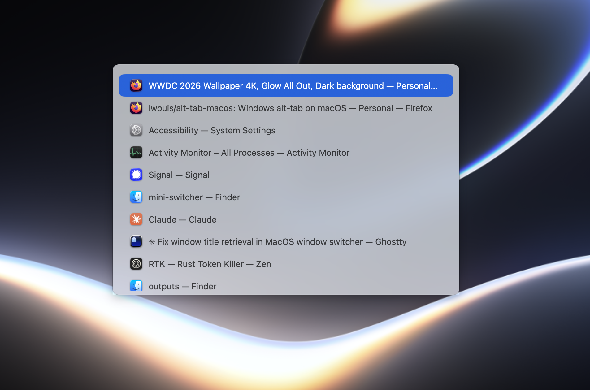

<h1 align="center">
  <br>
  Fonsterbyte
</h1>

<p align="center">A tiny macOS window switcher — a mini version of <a href="https://github.com/lwouis/alt-tab-macos">AltTab</a>.</p>

<p align="center">
  
</p>


macOS's built-in `⌘Tab` switches between *applications*. AltTab famously replaces
it with a switcher over individual *windows*, the way Windows and most Linux DEs
work. Fonsterbyte is a deliberately small take on that idea: one Swift file for the
app and one for its tests, no dependencies, no build system beyond `swiftc` and
`make`. It exists to show how little code the core of a window switcher actually
takes — list every window with its title and icon, and raise the one you pick.

## Features

- Press `⌘Tab` to pop up a list of all open **windows** (not just apps), each with
  its title and app icon.
- **Every window, wherever it is** — on another desktop, in a full-screen app that
  has a Space to itself, or minimized. Not just what happens to be on screen.
- **Ordered by how recently you used it**, across Spaces, so the window you just
  came from is one `Tab` away even if it lives on another desktop.
- Hold `⌘` and tap `Tab` to move forward, `⇧` to move backward — or hold either
  down to keep cycling at the system's key-repeat rate.
- **Type a letter to jump straight to a window**; it is underlined in the row. Every
  app gets its own initial where it can, and letters stay put from one switch to the
  next rather than shifting around as the list reorders.
- Press the key above `Tab` (`` ` `` on ANSI keyboards, `§` on ISO ones) to step
  through the windows of the app you are on, the way `` ⌘` `` does elsewhere.
- `↑`/`↓` to navigate, `Return` to switch, `Esc` to dismiss.
- **Click any row to switch to it instantly**, even while `⌘` is still held.
  Hovering previews a row and reverts if you leave without picking it.
- Releasing `⌘` commits the highlighted window — the familiar `⌘Tab` muscle memory.
- Opens on the display holding the **cursor**, not the one with the active window.
- Rows read `title — App`, collapsed to one name when a window is titled after its
  app, and a long title is truncated so the app name is always readable.
- Lives in the menu bar (no Dock icon); the system `⌘Tab` is taken over while
  running and restored when you quit.

## Requirements

- macOS 13 (Ventura) or later.
- The Swift toolchain (Xcode or the Command Line Tools: `xcode-select --install`).
- **Accessibility permission** — needed to read window titles and to raise a
  specific window. macOS will prompt on first launch; you can also grant it under
  *System Settings → Privacy & Security → Accessibility*, or via the menu-bar
  item's *Grant Accessibility Access…* entry. Without it the switcher still lists
  windows, including those on other Spaces, but they show as bare app names,
  minimized windows are missing, and picking a row can only activate its app —
  which lands on whichever of its windows the app itself prefers.

## Build & run

```sh
make build   # compile main.swift and assemble Fonsterbyte.app
make run     # build, then launch the app
make test    # run the tests in tests.swift
make clean   # remove build artifacts
```

`make test` compiles `tests.swift` together with `main.swift` under `-DTESTS`, which hands
the entry point to the test runner instead of `NSApplication`. Swift allows top-level code
in `main.swift` only, so this keeps the tests in one plain file with no test bundle, package
manifest or XCTest dependency. They cover row labelling, window-list filtering, jump-key
assignment, cycling within an app and list ordering — the parts that can be decided without
a live window server. Window discovery, titles, raising and the hotkeys need real windows,
Spaces and Accessibility permission, so those stay manual.

`make build` compiles `main.swift`, generates the app icon from an SF Symbol
(once, via `generate_icon.swift`), assembles `Fonsterbyte.app`, and ad-hoc
code-signs it. The signing step pins the bundle's *designated requirement* to the
bundle identifier rather than the binary hash, so the Accessibility grant survives
rebuilds — you don't have to re-approve the app every time you recompile.

After the first `make run`, grant Accessibility access when prompted, then trigger
`⌘Tab`.

## Releasing

Builds are published to [GitHub Releases](https://github.com/WilhelmBerggren/fonsterbyte/releases)
with the `gh` CLI. To cut a new release (e.g. `v0.1.2`):

1. **Bump `VERSION` in the `Makefile`**, then commit and push everything you want
   in the release; make sure `main` is in sync with `origin` (`git push`). The
   release tag points at the current `main` commit. `make build` stamps `VERSION`
   into the bundle, so the tag, `Get Info` and the Homebrew cask all agree.
2. **Build a fresh bundle and zip it.** Use `ditto` (not `zip`) so the `.app`
   structure and ad-hoc signature are preserved:
   ```sh
   make build
   ditto -c -k --sequesterRsrc --keepParent Fonsterbyte.app Fonsterbyte.zip
   ```
3. **Create the release**, attaching the zip:
   ```sh
   gh release create v0.1.2 Fonsterbyte.zip \
     --target main \
     --title "Fonsterbyte v0.1.2" \
     --notes "What changed in this release…"
   ```
4. **Verify** the asset uploaded: `gh release view v0.1.2`.

Notes:

- `Fonsterbyte.zip` is a build artifact and is git-ignored — it lives only as a
  release asset, never in the repo.
- The app is **ad-hoc signed and not notarized**, so Gatekeeper blocks it on
  other machines. Release notes should tell users to right-click → Open (or run
  `xattr -dr com.apple.quarantine Fonsterbyte.app`). A frictionless download
  would require a Developer ID signature plus notarization.

## How it works

The interesting bits live in `main.swift`:

- **Window list** comes from `CGWindowListCopyWindowInfo`. Its on-screen query covers
  the active Space only, and is the one list that carries z-order, so it goes first;
  minimized windows are then collected through the Accessibility API.
- **Windows on other Spaces** take a third pass. The unfiltered window list does
  contain them, but it can't tell a real window on another desktop from an app's
  never-shown placeholder window — both are merely "not on screen", and filtering by
  size or transparency keeps plenty of junk. The window server knows the difference,
  because only real windows are placed in a Space: `CGSCopyManagedDisplaySpaces` and
  `CGSCopyWindowsWithOptionsAndTags` yield exactly the set worth keeping.
- **Window titles** come from the Accessibility API. The tricky part is matching an
  `AXUIElement` back to a `CGWindowID`; the public AX API has no attribute for this,
  so Fonsterbyte uses the private `_AXUIElementGetWindow` symbol — the same approach
  AltTab uses. A `CGSCopyWindowProperty` window-server read is kept as a fallback.
- **`kAXWindowsAttribute` only ever reports the active Space**, which shapes two
  things. Titles of windows elsewhere are remembered from when they were last
  reachable, and so are their `AXUIElement` handles — a handle keeps working after
  its window leaves the Space, and raising through one is what makes picking a
  particular window of a multi-window app work at all from another desktop. Without
  it there is nothing to do but activate the app and let it choose the window.
- **Ordering** is remembered between switches. z-order exists only for the active
  Space, so a window on another desktop carries no hint of how recently it was used;
  the previous list is merged with live z-order, which keeps external raises correct
  while giving off-Space windows a rank they'd otherwise lack.
- **Taking over `⌘Tab`** is done by disabling the system symbolic hotkey
  (`CGSSetSymbolicHotKeyEnabled`) and registering our own Carbon hotkey. This change
  persists across process exits, so it's restored on quit and on `SIGINT`/`SIGTERM`.
  A Carbon hotkey fires once per physical press and never repeats, so holding `Tab`
  or `⇧` is driven by a timer that watches the keys' live state instead.

These rely on private/undocumented system symbols, which is why this is a learning
toy rather than something to ship. For a real, robust, configurable switcher, use
[AltTab](https://github.com/lwouis/alt-tab-macos).
